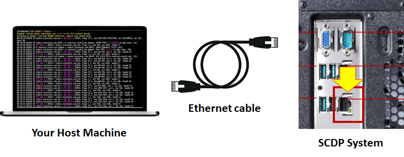
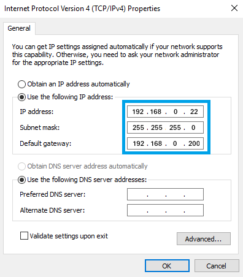
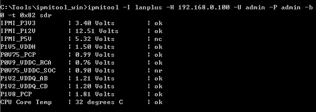

###  How to check the Power Voltage Readings Using Out-of-Band Management (OOBM)

MMC chip is located on COM-HPC-ALT COMe module which supports the power sequence control and hardware monitoring features (like CPU temperature, voltage readings,...). The procedure describes how to flash MMC firmware by using IPMI command.

Before start, please prepare the Ethernet cable and connect to your host machine and SCDP system like this:

**In your host Machine with Linux Environment:** 

- Configure the static IP Address on the network device and save it:

  - IP address: **192.168.0.22**

  - Netmask: **255.255.255.0**

  - Gateway: **192.168.0.200**

     

 **In your host Machine with Windows Environment:** 

- Configure the static IP Address on the network device and save it:

 

- the IP address of OOBM on SCDP system is **192.168.0.100**

- type the Ping command to see if the connection is alive

  > sushi@Sushi:~$ ping 192.168.0.100
  > PING 192.168.0.100 (192.168.0.100) 56(84) bytes of data.
  > 64 bytes from 192.168.0.100: icmp_seq=1 ttl=64 time=0.569 ms
  > 64 bytes from 192.168.0.100: icmp_seq=2 ttl=64 time=0.572 ms
  > 64 bytes from 192.168.0.100: icmp_seq=3 ttl=64 time=0.560 ms

- type command to check the power readings: 

  `ipmitool -I lanplus -H 192.168.0.100 -U admin -P admin -b 0 -t 0x82 sdr`

​        the result will be:

| Voltage Name   | Description                      |
| -------------- | -------------------------------- |
| IPMI P3V3      | 3.3 V for BMC chip               |
| IPMI_P12V      | main power for the system        |
| IPMI_P5V       | the standby power for the system |
| P1V5_VDDH      | CPU voltage                      |
| P0V75_PCP      | CPU voltage                      |
| P0V9_VDDC_RCA  | CPU voltage                      |
| P0V75_VDDC_SOC | CPU voltage                      |
| P1V2_VDDQ_AB   | CPU & Memory voltage             |
| P1V2_VDDQ_CD   | CPU & Memory voltage             |
| P1V8_PCP       | CPU voltage                      |
