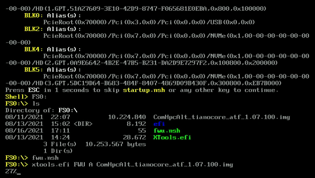

# 	How to update the edk2 firmware

 

The below  procedure describes how to flash and updated the edk2 firmware using a UEFI Shell on COM HPC ALT  system

 1. Click [here](https://hq0epm0west0us0storage.blob.core.windows.net/$web/public/COMe/Ampere/SCDP/EDK2-Binary/EDK2-FWU-20210811.zip) to download a zip files that includes the firmware update and a flashing tool. 

 2. Unzip the file and copy the files to the root directory of an empty USB drive with standard FAT32 format

   **Warning**: Data loss may result if written to the wrong device or in the worst case you kill your hosts OS.

 3. Insert the USB drive to SCDP system and power on the system up.

 4. On average it takes around 35 to 40 seconds after power on for the below screen to appear, 
    when it appears Press key several times to enter the edk2 setup menu

 

 4. After entering the menu will appear as the below 

 

 5. Go to the sub-menu of **[Boot Manager]** and Select to boot from **[UEFl Shell]**

 

 6. The USB drive  will appear with device name: **FS0** on the block device map 

 

 7. Change to FS0, list the contents and execute the update  

   > Shell> FS0:   
   >
   > FS0:\\> ls
   >
   > FS0:\\> fwu.nsh

 

 8. After the flash process has concluded (100%) power down and reboot the system