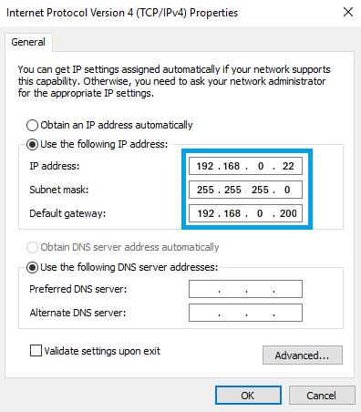
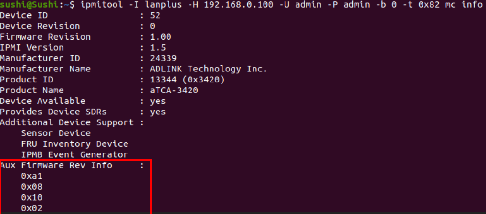

### How to Flash MMC Firmware Using Out-of-Band Management (OOBM)

MMC chip is located on COM-HPC-ALT COMe module which supports the power sequence control and hardware monitoring features (like CPU temperature, voltage readings,...). The procedure describes how to flash MMC firmware by using IPMI command.

Before start, please prepare the Ethernet cable and connect to your host machine and SCDP system like this:

**In your host Machine with Linux Environment:** 

- Configure the static IP Address on the network device and save it:

  - IP address: **192.168.0.22**

  - Netmask: **255.255.255.0**

  - Gateway: **192.168.0.200**

     

 **In your host Machine with Windows Environment:** 

- Configure the static IP Address on the network device and save it:

 

- the IP address of OOBM on SCDP system is **192.168.0.100**

- type the Ping command to see if the connection is alive

  > sushi@Sushi:~$ ping 192.168.0.100
  > PING 192.168.0.100 (192.168.0.100) 56(84) bytes of data.
  > 64 bytes from 192.168.0.100: icmp_seq=1 ttl=64 time=0.569 ms
  > 64 bytes from 192.168.0.100: icmp_seq=2 ttl=64 time=0.572 ms
  > 64 bytes from 192.168.0.100: icmp_seq=3 ttl=64 time=0.560 ms

- type command to see the MMC version: 

  `ipmitool -I lanplus -H 192.168.0.100 -U admin -P admin -b 0 -t 0x82 mc info`

   There are 3 bytes that combines the version on **Aux Firmware Rev Info**:
     - 0xa1  ( please ignore this byte)
     - 0x08 
     - 0x10
     - 0x02

-  Type command to upgrade the firmware: 

  `ipmitool -I lanplus -H 192.168.0.100 -U admin -P admin -b 0 -t 0x82 hpm upgrade hpm1all_081002.img activate force`

​           Note:

​                 - hpm1all_081002.img is the firmware file you woud like to flash

​                 - click [here](https://hq0epm0west0us0storage.blob.core.windows.net/$web/public/COMe/Ampere/SCDP/MMC_FW/hpm1all_081002.img) to download the latest MMC FW image (081002 version)

​       
**Once upgrade successfully, please to check the "Aux firmware Rec info" is the latest one.**

​    
