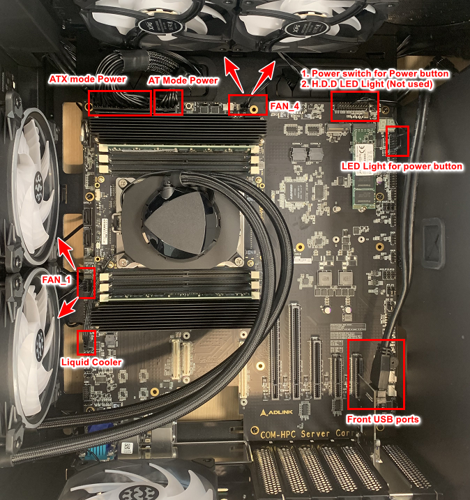
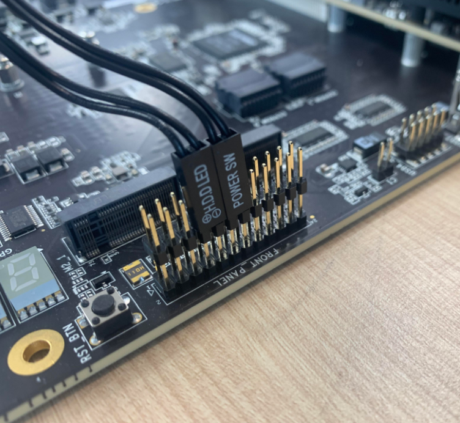
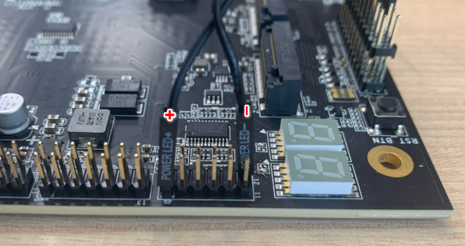
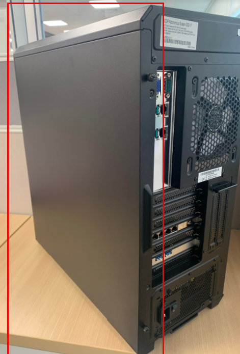
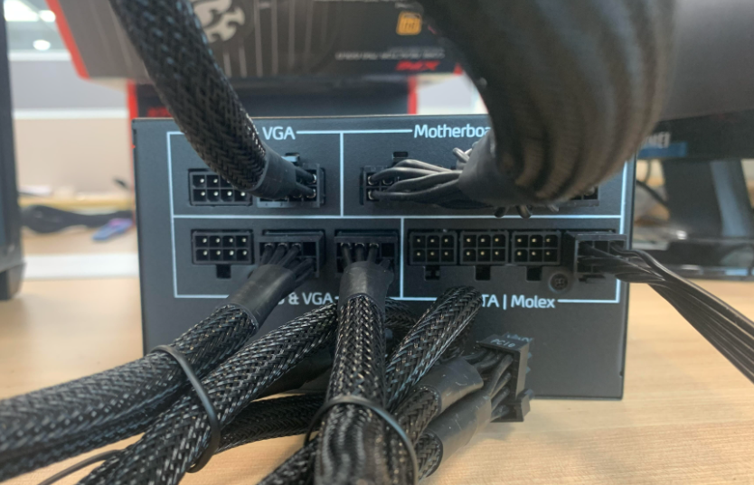
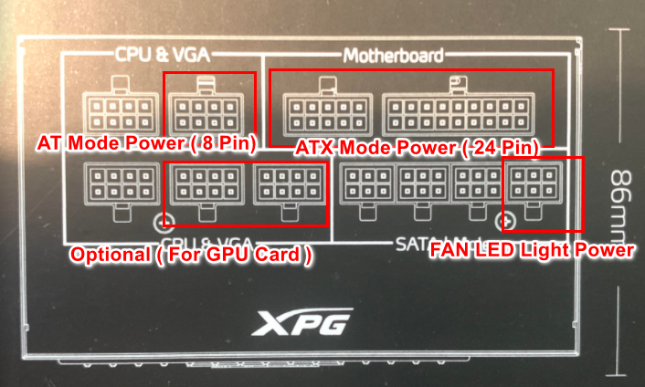

### Power Cable Connections 

It indicates that the overview of Power Cables on the Carrier Board inside SCDP System

- Indicates the connection for **"Power SW ( for Power Button)"** & **"H.D.D LED (Not used)"** 

- Indicates the connection for **"Power LED"** in the front panel of power button

- Please open the back side of plate to check the connection on Power supply

  

  

  - Unscrew the power supply and you would see like this:

    

  -  Here is the power cable connection inside the System and make sure it connected tightly

    - ATX Mode Power 
    - AT mode Power
    - FAN LED Light Power
    - Optional ( for GPU card): **at the moment, it won't be used**

