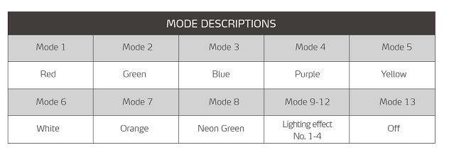
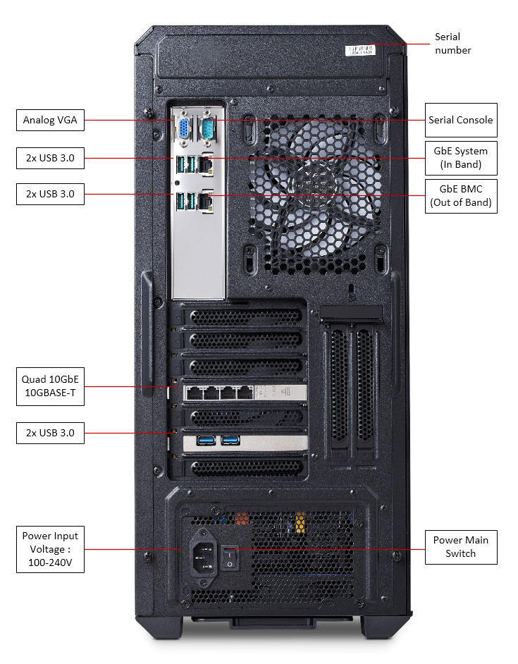
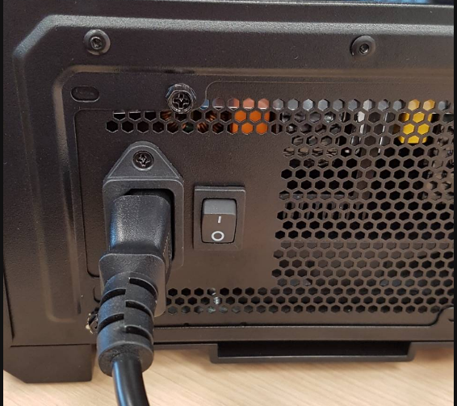

# Operation and Issues found

<br>

<br>

## Front Panel Operation and Interfaces

 

<br>

### Icons and ports 

 
<br>

#### USB 3.0 x2

The USB front panel are connected to the PCIex1 USB card 
<br>

#### Hybrid Audio Port

Is not active, this system does not support Audio
<br>

#### LED Button

For your entertainment during coding you can switch on the color mode of the 5 ARGB system fans in the enclosure. 
There are 12 color preset modes and an off mode.  Pressing this button cycles you through the preset modes. 

  
<br>

##### Power Button

Systems are configured for ATX mode operation.  See **"Power up/down and ACPI behavior"** below for particularities booting  up and shutting down
<br>
<br>

## Rear I/O and Power Supply 

 

<br>
<br>


## Power up/down and ACPI behavior

<br>

### Master switch on the power supply

 


Switch on power input to the system on the rear side of the system. This will energize the system but will not let it boot up. 

<br>

### ATX mode  power on with power button on front panel

Power button needs to be pushed for 2 seconds and than released than system will boot up

<br>

### ATX mode  power down with power button on front panel

Power button needs to be pushed for 2 seconds and than released than system will shutdown power

This does not sends a signal to the OS to do an orderly OS shutdown and than OS issue a poweroff  !!!

Instead pressing this button during operation leads to sudden hard power off 

<br>

### Reset or reboot

Does not work at this time. SOC deliver unreliable RESET information so we had to shut it down. There is no hard reset and no soft reset. 

A soft reset under Linux with command "sudo reboot" leads to a hanging system that can only be recovered by : 

- a hard power down on the switch located on the power supply
- power back on using the switch located on the power supply
- press  "Power Button"  on the front panel for 2 secs and release 
  <br> 
- 
- edk2 UEFI menu option RESET has the same result. 

This  is a problem if you want to operate the system remotely.
In remote case if you do a "sudo reboot" the system will just hang and not do the warm reboot

<br>
<br>
<br>

## Ampere Altra Turbo mode

We ran into this testing the 32-core. 

Turbo means 1.7 Ghz, but the current systems are running at 1.5 Ghz

Ampere is debugging this, there seems to be a relation to VR power problems on our board that automatically blocks the turbo option from being enabled. 

This is under study

<br>
<br>
<br>
## Ubuntu installation 

Systems  come standard  preinstalled with Ubuntu Server Ubuntu Server 20.04 aarch64 version. 
<br>
Below is the procedure that was  followed to get to that install 
<br>
OS  installed on SCDP Kraken is off the shelve Ubuntu Server 20.04 aarch64 

https://ubuntu.com/download/server/arm

Our particular version was Ubuntu Server 20.04.2 aarch64
<br>
system name : 						comhpcalt
standard username : 			 adlink
standard password (root) :    adlink123

<br>
### Update and upgrade packages

login to fresh installed Ubuntu server and  
```asp
sudo apt update
sudo apt ugrade
```

Than upgrade to kernel to 5.11 (HWE)
```asp
sudo apt install --install-recommends linux-generic-hwe-20.04 
```

<br>

###  Update Intel 10GbE drivers

The Kraken SCDP includes a PCIe x8 Intel X710 Quad 10GbE (10GBASE-T) NIC accessible on the rear of the system. 

 


The Ubuntu distribution does provides Intel's latest drivers so we update them as below  

Download the latest driver from Intel's homepages here : 

https://intel.com/content/www/us/en/download/18026/intel-network-adapter-driver-for-pcie-40-gigabit-ethernet-network-connections-under-linux.html

File name downloaded :  i40e-2.16.11.tar.gz    size: 630.6 KB    

```cpp
tar -zxvf i40e-2.16.11.tar.gz
cd i40e-2.16.11.tar.gz/src
make && sudo make install
```

Reboot

<br>

During reboot and reading out dmesg we found a lot of PCIe AER messages we think are relate to the Intel LAN drivers. All these errors are on link level, not hardware level, and all errors are corrected. 

```asp
[   77.119951] pcieport 0000:00:01.0: AER: Corrected error received: 0000:01:00.0
[   77.119973] i40e 0000:01:00.0: PCIe Bus Error: severity=Corrected, type=Data Link Layer, (Transmitter ID)
[   77.119981] i40e 0000:01:00.0:   device [8086:1589] error status/mask=00001000/00002000
[   77.119990] i40e 0000:01:00.0:    [12] Timeout

[   81.119894] pcieport 0000:00:01.0: AER: Corrected error received: 0000:01:00.0
[   81.119922] i40e 0000:01:00.0: PCIe Bus Error: severity=Corrected, type=Data Link Layer, (Transmitter ID)
[   81.119933] i40e 0000:01:00.0:   device [8086:1589] error status/mask=00001000/00002000
[   81.119944] i40e 0000:01:00.0:    [12] Timeout
```

We decided to turn AER reporting of as follows 

```asp
sudo vi /etc/default/grub
```

make sure no AER is entered as below : 

```asp
GRUB_CMDLINE_LINUX_DEFAULT="pci=noaer"
```

Than to update grub and initialize file system 

```asp
sudo update-grub
sudo update-initramfs -u
```

Reboot

<br>

### Network interface configuration 

All interfaces have been setup to get IP number from a DHCP server. 


You can verify the network configuration file as below 

```cpp
$ less /etc/netplan/00-installer-config.yaml


# This is the network config written for 'Kraken SCDP'

network:
  ethernets:

# i210 1GbE
    enP4p4s0:
      dhcp4: true

# i40e Quad 10GbE

    enp1s0f0:
      dhcp4: true

    enp1s0f1:
      dhcp4: true

    enp1s0f2:
      dhcp4: true

    enp1s0f3:
      dhcp4: true

  version: 2
```


<br>

## RTC clock cannot be set

<br>The first 8 systems shipped to ARM internally have this problem. 
<br>
There is a problem with access to the RTC under linux. Only way to get a correct system time is having a connection the the Internet !!  In this Ubuntu install we have enabled ntp 

```cpp
adlink@comhpcalt:~$ timedatectl
               Local time: Thu 2021-08-12 07:19:03 UTC
           Universal time: Thu 2021-08-12 07:19:03 UTC
                 RTC time: Sun 2017-01-01 10:00:00
                Time zone: Etc/UTC (UTC, +0000)
System clock synchronized: yes
              NTP service: active
          RTC in local TZ: no
```

<br>

Trying to forcibly update the RTC also leads to an error`

```cpp
adlink@comhpcalt:~$ sudo hwclock --verbose

hwclock from util-linux 2.34
System Time: 1628752822.679642
Trying to open: /dev/rtc0
Using the rtc interface to the clock.
Assuming hardware clock is kept in UTC time.
Waiting for clock tick...
ioctl(4, RTC_UIE_ON, 0): Invalid argument
Waiting in loop for time from /dev/rtc0 to change
hwclock: Timed out waiting for time change.
...synchronization failed

```

<br>

#### edk2 update for RTC problem 

An update to the edk2 firmware that has the correct RTC code fixes this problem

see howto for updating edk2 [here](edk2-firmware-updating.md)

<br><br>


